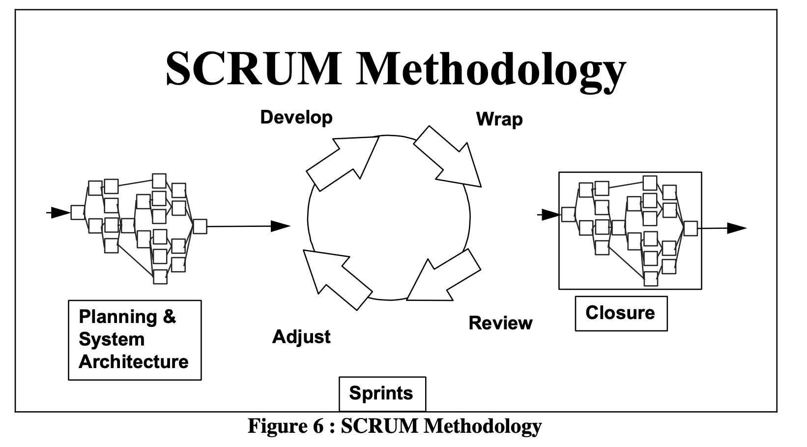
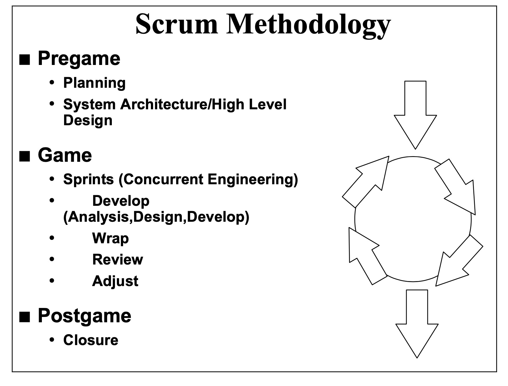
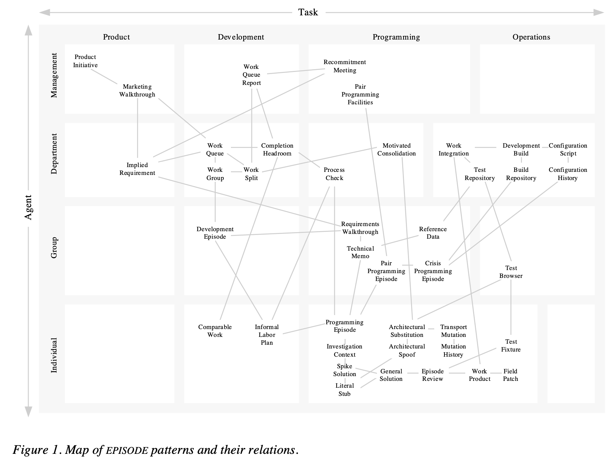
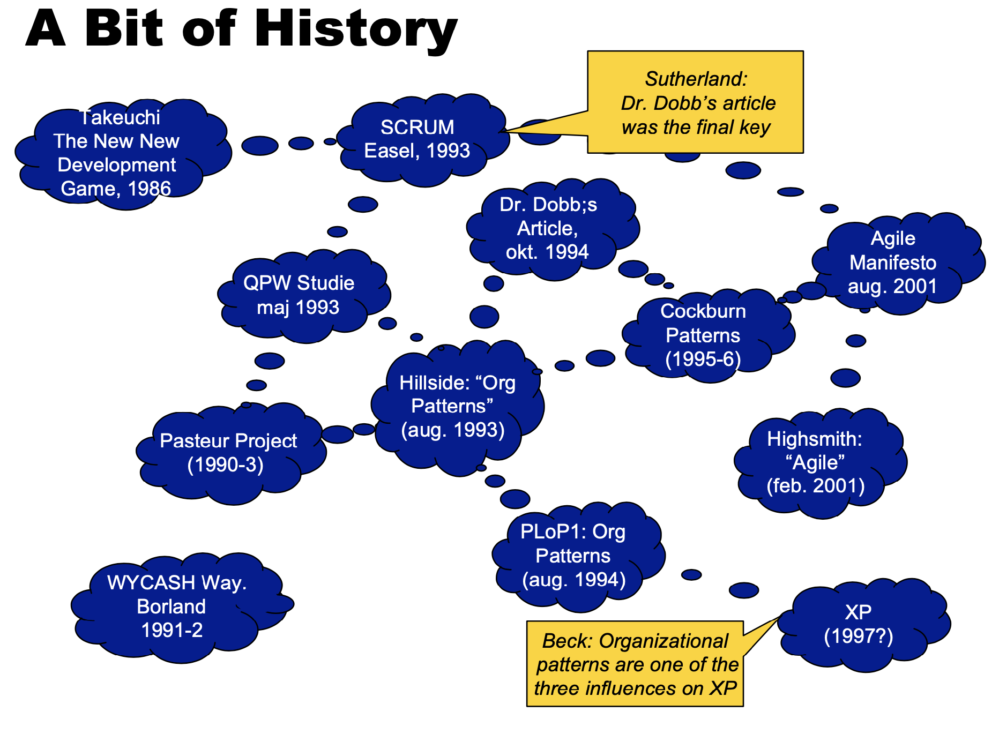
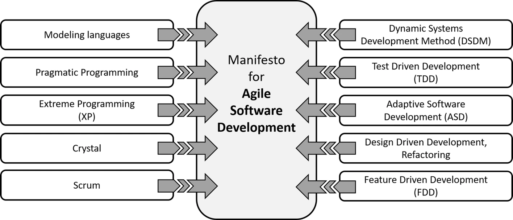
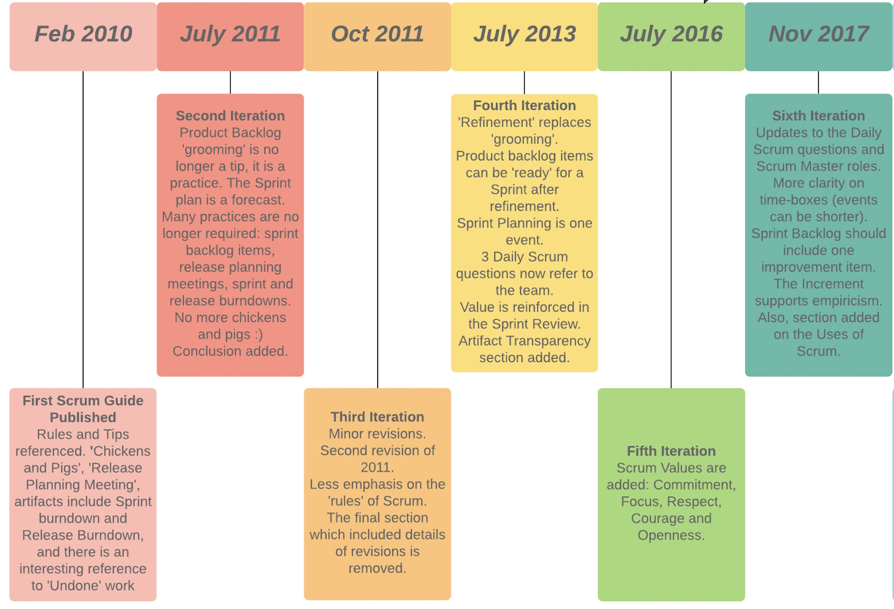
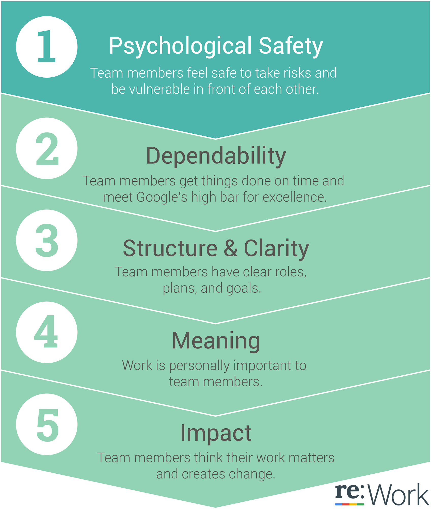
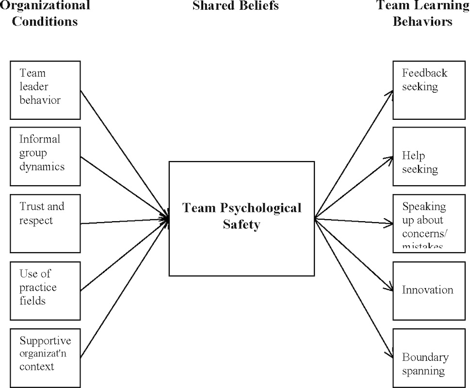

### Scrum Pattern Language Discussion

---
## agenda
- principles, definitions and well-known examples
- agile, scrum & organisational patterns
- snake oil & productivity 
- ideas & recommendations
---
## One principle
---
### Gojko Adzic 2009
"I am getting more and more convinced every day that communication is, in fact, what makes or breaks software projects. Programming tools, practices and methods are definitely important, but if the communication fails then the rest is just painting the corpse."
---
## Definitions
---
[A pattern]( https://en.wikipedia.org/wiki/Pattern) is a regularity in the world, in human-made design, or in abstract ideas. As such, the elements of a pattern repeat in a predictable manner.
---
- [Software design pattern](https://en.wikipedia.org/wiki/Software_design_pattern) is a general, reusable solution to a commonly occurring problem within a given context in software design.
- [An architectural pattern](https://en.wikipedia.org/wiki/Architectural_pattern) is a general, reusable solution to a commonly occurring problem in software architecture within a given context.
- [Organisational patterns](https://en.wikipedia.org/wiki/Organizational_patterns) are arrangements or systems of internal relationship which give to any culture its coherence.
---
[A pattern language](https://en.wikipedia.org/wiki/Pattern_language) is an organized and coherent set of patterns, each of which describes a problem and the core of a solution that can be used in many ways within a specific field of expertise. 
---
## Usage
---
### organisational improvement 
- Find the weakest part of your organization
- Find a pattern that is likely to strengthen it
- Apply the pattern
- Measure the improvement or degradation
- If the pattern improved things, go to step 1 and find the next improvement; otherwise, undo the pattern and try an alternative.
---
## Well-Known Examples
---
### GOF aka Gamma et al 1995. 
- [Design Patterns: Elements of Reusable Object-Oriented Software.](https://en.wikipedia.org/wiki/Design_Patterns)  
- Creational, Behavioral and Structural patterns
- Iterator, visitor, Bridge, Builder, Decorator, ..
---

---
### POSA 1 aka Buschmann et al 1996. 
- [Pattern-Oriented Software Architecture, Volume 1: A System of Patterns.](https://en.wikipedia.org/wiki/Pattern-Oriented_Software_Architecture)
- Architectural and Design Pattern, Idioms
- Layers, Pipes and Filters, Broker, Model-View-Controller, .. 
---

---
### Hohpe & Woolf 2003. 
- [Enterprise Integration Patterns: Designing, Building, and Deploying Messaging Solutions.](https://www.enterpriseintegrationpatterns.com/) 
- Channel, Message Construction, Routing, Transformation, Endpoint and System Management Patterns.
- Idempotent Receiver, Message Bus, Canonical Data Model, ..
---

---
### Evans 2004. 
- [Domain-Driven Design: Tackling Complexity in the Heart of Software.](https://en.wikipedia.org/wiki/Domain-driven_design)
- "structure of practices and terminology for making design decisions that focus and accelerate software projects dealing with complicated domains."
- [Bounded Context](https://martinfowler.com/bliki/BoundedContext.html), Ubiquitous language, ..
---

---
### Coplien & Harrison 2004.
- [Organizational Patterns of Agile Software Development](https://en.wikipedia.org/wiki/Organizational_patterns)
- "organizational patterns aren't created or invented: they are discovered (or "mined") from empirical observation."
- Organisational Style, People & Code, Piecemeal Growth & Project management pattern languages
- Self selecting team, Unity of Purpose, ..
---

---

---

---

---
### Priest et al late 2010's. 
- [Sociocracy 3.0 patterns](https://patterns.sociocracy30.org/)
- Pattern groups for Co-Creation And Evolution, Peer Development, Enablers Of Collaboration, Building Organizations, Bringing In S3, Defining Agreements, Focused Interactions, Meeting Practices, Organizing Work, Organizational Structure
- Navigate Via Tension, Consent Decision Making, ..
---

---
### Additional technical patterns
- [Software architecture development](https://www.amazon.de/-/en/dp/B07X8289XR/) has its own pattern language.
- [Cloud Computing](https://www.springer.com/gp/book/9783709115671) can be seen as pattern language.
- [Microservices architecture](https://microservices.io/) can be described with pattern language.
---
### Additional organisational patterns
- [Driving change](https://fearlesschangepatterns.com/) can be guided by patterns.
- [Liberationg structures](https://thesystemsthinker.com/liberating-structures-a-new-pattern-language-for-engagement/) can be seen as pattern language for engagement.
---
## Scrum, Organisational Patterns & Agile
---
### Schwaber 1995
- ["SCRUM Development Process"](https://www.semanticscholar.org/paper/SCRUM-Development-Process-Schwaber/8e1c7055ee7f45581fb19934d5aef2b48b931802)
- Called process and methodology in first papers, later defined as framework
- Idea of daily Scrum is from organizational patterns research on the Borland QPW project. 
- Influenced by Nonaka & Takeuchi: "New New Product Development Game" (1986), Seci-model (1990)
---

---
- SCRUM assumes that the systems development process is an unpredictable, complicated process that can only be roughly described as an overall progression. 
- SCRUM defines the systems development process as a loose set of activities that combines known, workable tools and techniques with the best that a development team can devise to build systems. Since these activities are loose, controls to manage the process and inherent risk are used. 
- SCRUM is an enhancement of the commonly used iterative/incremental object-oriented development cycle.
---

---
### Cunningham 1995
- ["EPISODES: A Pattern Language of Competitive Development"](episodes.fed.wiki.org/) 
- "We find ourselves unable under competitive pressure to make the kind of careful decisions we would like. These patterns tell what decisions can be made, in fact should be made, to maintain continuous forward motion through iterative development."
---

---
### Coplien & Schmidt 1995
- ["A Development Process Generative Pattern Language"](https://www.semanticscholar.org/paper/A-development-process-generative-pattern-language-Coplien/04d923750e0beea90c3ec84082ad4bcc1ac690b0)
- Patterns can be used to build an organization and to guide its development process in the domain of software development.
- A good set of organizational patterns helps to (indirectly) generate the right process.
---

---
### Cockburn 95 - 96
- ["Patterns of Project Management Risk Reduction"](https://www.google.com/url?sa=t&rct=j&q=&esrc=s&source=web&cd=&cad=rja&uact=8&ved=2ahUKEwi42oWh1PXpAhUE66QKHWv6AlwQFjAAegQIAxAB&url=https%3A%2F%2Falistair.cockburn.us%2Fwp-content%2Fuploads%2F2018%2F02%2F73b65078-ec7f-44b5-b141-0b120336e767.pdf&usg=AOvVaw3xdKakfBBOZP0Smo4EWF9w)
- "Each situation results from some force getting out of balance. So, one pattern may remedy several situations."
- "Similarly, any one situation has several possible remedies, depending on small variations in the situation, or your personal management style."
---

---
### Beedle et al. 1997.
- ["SCRUM: An extension pattern language for hyperproductive software development"](https://www.semanticscholar.org/paper/SCRUM%3A-An-extension-pattern-language-for-hyper-Beedle-DeVos/8658dbfb4bc0f8474a513adf0b51b1cfc2419a02)
- "When combined together, SCRUM and other organizational patterns, and specially those by Coplien, provide with an adaptive, yet well structured software development organization."
- Beedle's work with Sutherland brought the pattern perspective to Scrum.
---

---
### Agile Manifesto 2001 
- "a bigger gathering of organizational anarchists would be hard to find, so what emerged from this meeting was symbolic"
- Cockburn: "I personally didn't expect that this particular group of agilites to ever agree on anything substantive."
---

---
### Sutherland et al 2010 - 2017 
- [Scrum Guide](https://www.scrumguides.org/), [6 versions until now](https://www.scrumguides.org/revisions.html)
- 2010 Chickens and Pigs, 2011 Grooming, 2013 Refinement, 2016 Values, 2017 One improvement item to each Sprint, .. 
- Last release 2017 added team autonomy by softening mandatory process and role of Scrum Master
---

---
### Beedle et al 2010 (working paper)
- ["Essential Scrum Patterns"](https://www.google.com/url?sa=t&rct=j&q=&esrc=s&source=web&cd=&ved=2ahUKEwiAi7CTrfLpAhVnzqYKHXATCmcQFjAAegQIAxAB&url=http%3A%2F%2Fwww.hillside.net%2Fplop%2F2010%2Fpapers%2Fbeedle.pdf&usg=AOvVaw1ykjztZJZ-eRWt7WUQL2ti)
- Product Backlog, ProductOwner, ScrumTeam, ScrumMaster, Sprint Backlog, Sprint Planning Meeting, Sprint, Daily Scrum, Sprint Burndown, Sprint Review Meeting 
- Close to Essential: Sprint Retrospective, Release Planning Meeting, Release Burndown, Visible Status 
---

---
### Sutherland & al 2014
- ["Teams that Finish Early Accelerate Faster: A Pattern Language for High Performing Scrum Teams"](https://www.semanticscholar.org/paper/Teams-That-Finish-Early-Accelerate-Faster%3A-A-for-Sutherland-Harrison/cb929a4e0a9fd949fbc16bb29da0d8995d23a6bb)
- A Scrum Pattern is a general reusable solution to a commonly occurring problem within the Scrum framework.
- A subset of the Scrum patterns form in essence a vocabulary of a Pattern Language for Hyper-Productive Teams.
---
1. [Stable Teams](https://sites.google.com/a/scrumplop.org/published-patterns/product-organization-pattern-language/development-team/stable-teams)
2. [Yesterday’s Weather](https://sites.google.com/a/scrumplop.org/published-patterns/value-stream/estimation-points/yesterday-s-weather)
3. [Swarming: One Piece Continuous Flow](https://sites.google.com/a/scrumplop.org/published-patterns/product-organization-pattern-language/development-team/swarming--one-piece-continuous-flow)
4. [Interrupt Pattern: Illigitimus Non Interruptus](https://sites.google.com/a/scrumplop.org/published-patterns/product-organization-pattern-language/illegitimus-non-interruptus)
5. [Daily Clean Code](https://sites.google.com/a/scrumplop.org/published-patterns/value-stream/good-housekeeping)
6. [Emergency Procedure](https://sites.google.com/a/scrumplop.org/published-patterns/product-organization-pattern-language/emergency-procedure)
7. [Scrumming the Scrum](https://sites.google.com/a/scrumplop.org/published-patterns/retrospective-pattern-language/scrumming-the-scrum)
8. [Happiness Metric](https://sites.google.com/a/scrumplop.org/published-patterns/retrospective-pattern-language/happiness-metric)
9. [Teams that Finish Early Accelerate Faster](https://sites.google.com/a/scrumplop.org/published-patterns/retrospective-pattern-language/teams-that-finish-early-accelerate-faster)
---
### Sutherland et al 2019
- ["A Scrum Book"](https://pragprog.com/titles/jcscrum/)
- Scrum Guide describes the basic rules of Scrum, the patterns amplify the guide by showing teams how to solve problems in a specific context.
- Product Organization (1-39) and Value Stream (40-94) [Pattern Languages](https://sites.google.com/a/scrumplop.org/published-patterns/book-outline/patlets) extend [core patterns](https://sites.google.com/a/scrumplop.org/published-patterns/book-outline/the-core-patterns-in-brief).
- [A Project Language of Highly Effective Teams](https://sites.google.com/a/scrumplop.org/published-patterns/sequences/a-project-language-of-highly-effective-teams) as example of project pattern language.
---

---

---
## hyperproductivity patterns
---
### [Stable Teams §15](https://sites.google.com/a/scrumplop.org/published-patterns/product-organization-pattern-language/development-team/stable-teams)  
- If you need predictability, then keep teams stable and avoid shuffling people around between teams.
---
### [Yesterday’s Weather §66](https://sites.google.com/a/scrumplop.org/published-patterns/value-stream/estimation-points/yesterday-s-weather)
- If courage emboldens the team to set overoptimistic goals, then refer to the work Done in the last Sprint to forecast the work for the upcoming Sprint.
---
### [Swarming: One Piece Continuous Flow §25](https://sites.google.com/a/scrumplop.org/published-patterns/product-organization-pattern-language/development-team/swarming--one-piece-continuous-flow)
- Working on too many things at once reduces velocity and the quality of work. Therefore, have the whole Development Team work together on one Product Backlog Item at a time.
---
### [Interrupt Pattern: Illigitimus Non Interruptus §33](https://sites.google.com/a/scrumplop.org/published-patterns/product-organization-pattern-language/illegitimus-non-interruptus)
- If various stakeholders and emergent requirements interrupt the team, crippling its progress, then explicitly allot time for interrupts and time-box unplanned work to that budget.
---
### [Good Housekeeping aka Daily Clean Code §80](https://sites.google.com/a/scrumplop.org/published-patterns/value-stream/good-housekeeping)
- Where there’s a mess, you lose time and energy finding where and what to start on. Therefore, maintain a completely clean product and work environment continuously, or clean at the end of each day.
---
### [Emergency Procedure §32](https://sites.google.com/a/scrumplop.org/published-patterns/product-organization-pattern-language/emergency-procedure)
- Inevitably, unanticipated problems arise and cause the Sprint Goal to slip out of reach, but waiting until the Sprint Review derails the whole Sprint. Therefore, reevaluate the work plan mid-Sprint and escalate the solution with a predefined procedure.
---
### [Scrumming the Scrum §92](https://sites.google.com/a/scrumplop.org/published-patterns/retrospective-pattern-language/scrumming-the-scrum)
- Scrum is more than just doing work; it’s also about improving the way we work. Therefore, resolve the most important impediment by putting one in the Product Backlog every Sprint.
---
### [Happiness Metric §91](https://sites.google.com/a/scrumplop.org/published-patterns/retrospective-pattern-language/happiness-metric)
- If a growing list of improvement activities dampens the team's passion for the work, then prioritize the items on the impediment list in order of the team’s passion to solve them.
---
### [Teams that Finish Early Accelerate Faster §74](https://sites.google.com/a/scrumplop.org/published-patterns/retrospective-pattern-language/teams-that-finish-early-accelerate-faster)
- Teams often take too much work into a Sprint and cannot finish it. Failure to attain the Sprint Goal prevents the team from improving. Therefore, take less work into a Sprint.
---
# team patterns
---
### [Collocated Team §8](https://sites.google.com/a/scrumplop.org/published-patterns/product-organization-pattern-language/development-team/collocated-team) 
- If the complexity of collaborative development demands high-fidelity communication, then locate the team together within talking distance.
---
### [Small Teams §9](https://sites.google.com/a/scrumplop.org/published-patterns/product-organization-pattern-language/development-team/small-teams)
- Having many people working on the same thing inflates communication overhead. Therefore, use small teams of people working on serialized work rather than striving for false parallelism.
---
### [Cross-Functional Team § 10](https://sites.google.com/a/scrumplop.org/published-patterns/product-organization-pattern-language/development-team/cross-functional-team) 
- Organizations often organize around areas of competence, but it is too slow to coordinate across these boundaries. Therefore, the team as a whole should embody all the talent necessary to deliver product.
---
### [Autonomous Team §16](https://sites.google.com/a/scrumplop.org/published-patterns/product-organization-pattern-language/development-team/autonomous-team)
- If policies and procedures applied across multiple contexts are dysfunctional, then the Scrum Team governs its work free from external control, and the Development Team manages its own work.
---
### [Self-Organising Team §17](https://sites.google.com/a/scrumplop.org/published-patterns/product-organization-pattern-language/development-team/self-organizing-team)
- Specialized skills can't accomplish work without coordination. Therefore, the Development Team organizes itself to get its work Done.
---
## Productivity
---
### Team Effectiviness @ Google
- [Psychological safety](https://en.wikipedia.org/wiki/Psychological_safety): Can we take risks on this team without feeling insecure or embarrassed?
- Dependability: Can we count on each other to do high quality work on time?
- Structure & clarity: Are goals, roles, and execution plans on our team clear?
- Meaning of work: Are we working on something that is personally important for each of us?
- Impact of work: Do we fundamentally believe that the work we’re doing matters?
---

---
### not significantly connected with team effectiveness @Google
- Colocation of teammates (sitting together in the same office)
- Consensus-driven decision making
- Extroversion of team members
- Individual performance of team members
- Workload size
- Seniority
- Team size
- Tenure
---

---
### Gallup
- ["Worldwide, 13% of Employees Are Engaged at Work"](https://news.gallup.com/poll/165269/worldwide-employees-engaged-work.aspx)
- See it positively: "Low workplace engagement offers opportunities to improve business outcomes"
---
## ideas & recommendations
---
### Teams are units of action
- each team should be aware of default process which has worked in the past.
- [selecting default](https://jamesclear.com/design-default) should be easy and not selecting default should be possible.
---
### Provide seed process and invite to co-develop
- find point of improvement and envision default process which addresses current needs.
- make fork of selected industry practices and share them as pattern language.
---
### Teams decide their own process 
- “build the right process and you’ll build the right product”
- team can decide to use provided material as is or adjust it for their use
---
### Retrospectives used for reflection 
- make sure patterns and templates are living artifacts and reflect many valid viewpoints
- controlled chaos needs some streering structures, which itself can be described as pattern language   
---
## Closing
---
### Sprenger 2002
“Trust allows coordinated action between partners who do not know each other. It is a substitute for knowledge of others and their motives”
--- 
## Thanks for discussing!
- https://github.com/nikkijuk/scrum-pattern-language-discussion
---
## Extras
---
### Sauna Sprint Review
- After a particularly successful sprint, or a sprint that is otherwise worthy of celebration, rent a sauna for the sprint review. 
- Start the meeting with a very information review of the sprint activities, focusing on both good and bad as usual. 
- As the meeting goes on, segue into the social side of the event and allow it to continue into the night. 
- Be sure to include local food and some champagne.
