### Scrum Pattern Language Discussion

---
## agenda
- principles, definitions and well-known examples
- scrum as pattern language
- agile software architecture patterns 
- crafting your own pattern language
---
## One principle
---
### Gojko Adzic 2009
"I am getting more and more convinced every day that communication is, in fact, what makes or breaks software projects. Programming tools, practices and methods are definitely important, but if the communication fails then the rest is just painting the corpse."
---
## Definitions
---
[A pattern]( https://en.wikipedia.org/wiki/Pattern) is a regularity in the world, in human-made design, or in abstract ideas. As such, the elements of a pattern repeat in a predictable manner.
---
- [Software design pattern](https://en.wikipedia.org/wiki/Software_design_pattern) is a general, reusable solution to a commonly occurring problem within a given context in software design.
- [An architectural pattern](https://en.wikipedia.org/wiki/Architectural_pattern) is a general, reusable solution to a commonly occurring problem in software architecture within a given context.
- [Process patterns](https://en.wikipedia.org/wiki/Process_patterns) can be defined as the set of activities, actions, work tasks or work products and similar related behaviour followed in a [software development life cycle](https://en.wikipedia.org/wiki/Software_development_process).
---
[A pattern language](https://en.wikipedia.org/wiki/Pattern_language) is an organized and coherent set of patterns, each of which describes a problem and the core of a solution that can be used in many ways within a specific field of expertise. 
---
## Well-Known Examples
---
### GOF aka Gamma et al 1995. 
- Design Patterns: Elements of Reusable Object-Oriented Software.  
- Creational, Behavioral and Structural patterns
- Iterator, visitor, Bridge, Builder, Decorator, ..
---
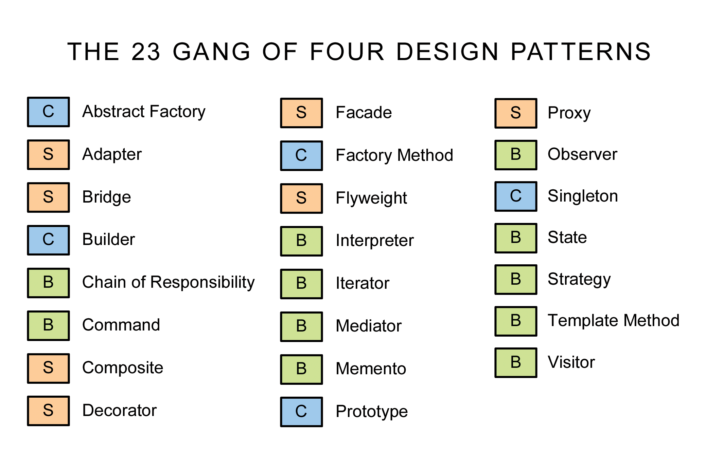
---
### POSA 1 aka Buschmann et al 1996. 
- Pattern-Oriented Software Architecture, Volume 1: A System of Patterns.
- Architectural and Design Pattern, Idioms
- Layers, Pipes and Filters, Broker, Model-View-Controller, .. 
---
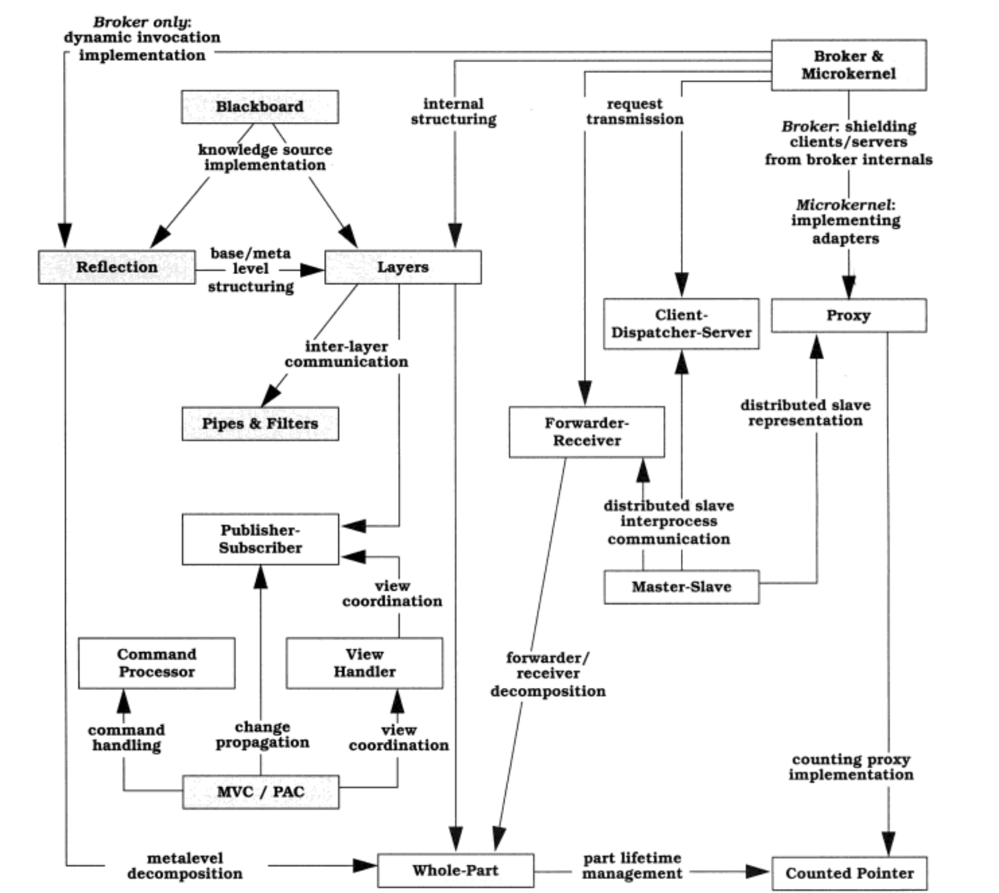
---
### Hohpe & Woolf 2003. 
- Enterprise Integration Patterns: Designing, Building, and Deploying Messaging Solutions. 
- Channel, Message Construction, Routing, Transformation, Endpoint and System Management Patterns.
- Idempotent Receiver, Message Bus, Canonical Data Model, ..
---
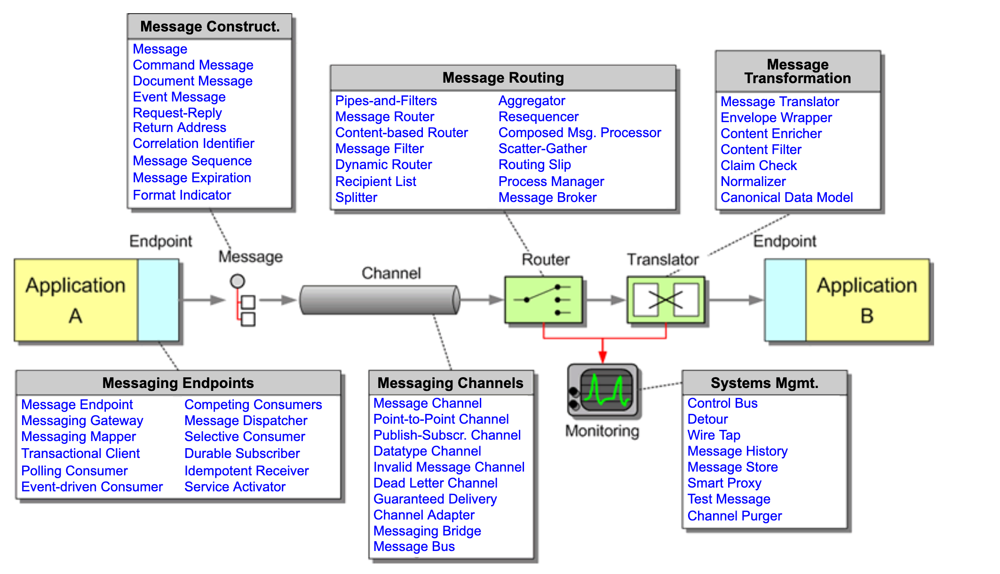
---
### Evans 2004. 
- Domain-Driven Design: Tackling Complexity in the Heart of Software.
- Organized by process, not by patterns
- Bounded Context, Ubiquitous language, ..
---
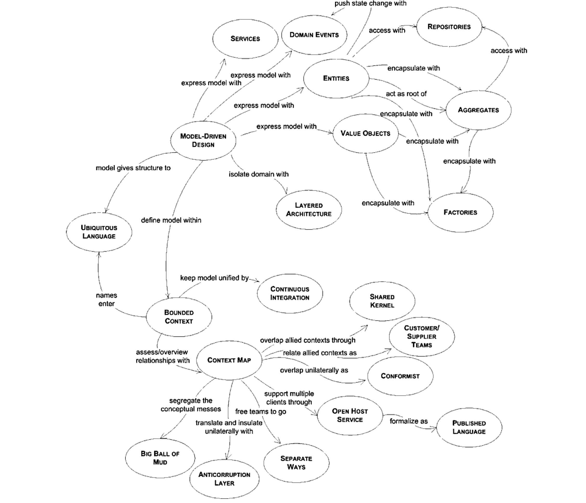
---
### Coplien & Harrison 2004
- Organizational Patterns of Agile Software Development
- Organisational Style, People & Code, Piecemeal Growth & Project management pattern languages
---
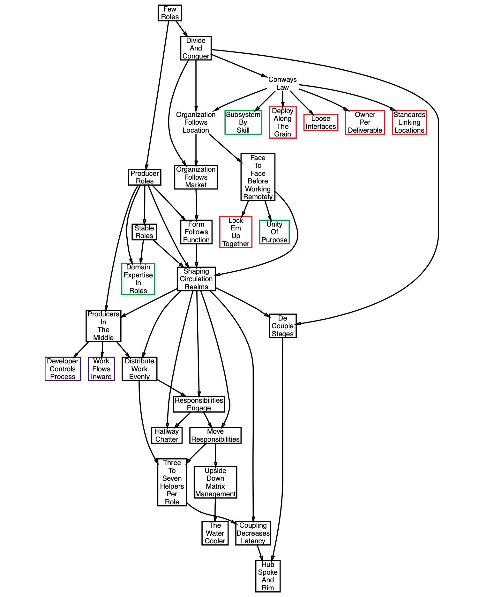
---
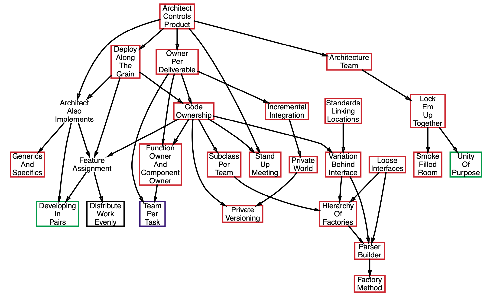
---
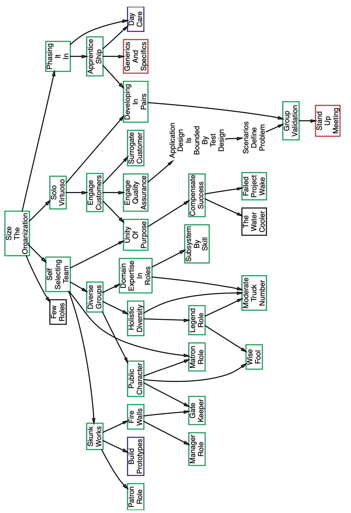
---
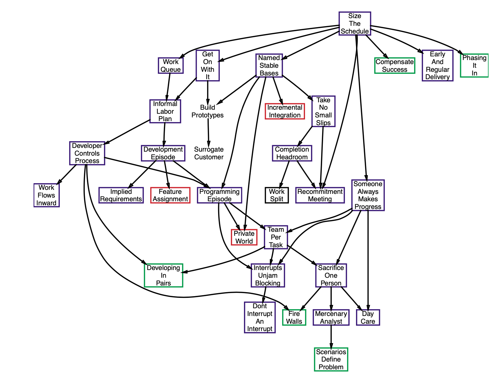
---
### Priest et al late 2010's. 
- Sociocracy 3.0 patterns
- Pattern groups for Co-Creation And Evolution, Peer Development, Enablers Of Collaboration, Building Organizations, Bringing In S3, Defining Agreements, Focused Interactions, Meeting Practices, Organizing Work, Organizational Structure
- Navigate Via Tension, Consent Decision Making, ..
---
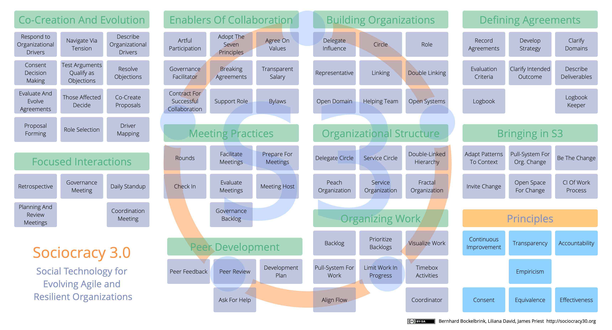
---
## Agile, Scrum & Patterns
---
### Agile  
- [Mike Beedle](https://en.wikipedia.org/wiki/Mike_Beedle) proposed "Agile". 
- "We had proposed Adaptive, Essential, Lean and Lightweight. We did not want to use Adaptive because Jim Highsmith had given this to one of his works. Essential sounded overly proud. Lean had already been taken. Nobody wanted to be a lightweight. We did this late in the second day and it took only a few minutes to decide on this."
- Mike Beedle was the first adopter of the Scrum method and author of second scrum paper. 
---
### Coplien & Schmidt 1995.
- Pattern Languages of Program Design
- "A Development Process Generative Pattern Language"
---
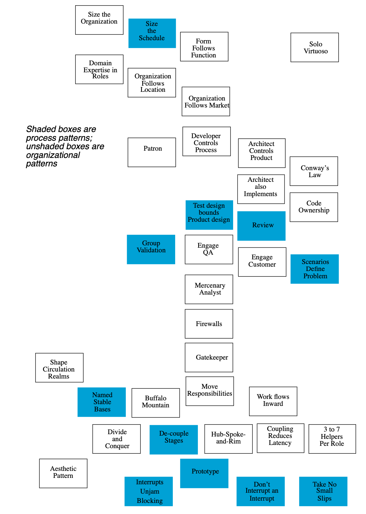
---
### Beedle et al. 1997.
- SCRUM: An extension pattern language for hyperproductive software development
- "When combined together, SCRUM and other organizational patterns [OrgPatt], and specially those by James O. Coplien [Coplien95], provide with an adaptive, yet well structured software development organization."
---
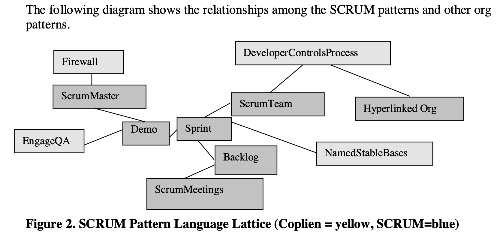
---
### Beedle et al 2010
- "Essential Scrum Patterns"
- Product Backlog, ProductOwner, ScrumTeam, ScrumMaster, Sprint Backlog, Sprint Planning Meeting, Sprint, Daily Scrum, Sprint Burndown, Sprint Review Meeting 
- Close to Essential: Sprint Retrospective, Release Planning Meeting Release Burndown, Visible Status 
---

---
### Sutherland & al 2014
- "Teams that Finish Early Accelerate Faster: A Pattern Language for High Performing Scrum Teams"
- Stable Teams were necessary for hyperproductivity. We decided to systematically investigate every other major problem that blocks a team from finishing early.
- A subset of the Scrum patterns form in essence a vocabulary of a Pattern Language for Hyper- Productive Teams.
---
1. Stable Teams
2. Yesterday’s Weather
3. Swarming: One Piece Continuous Flow
4. Interrupt Pattern: Illigitimus Non Interruptus
5. Daily Clean Code
6. Emergency Procedure
7. Scrumming the Scrum
8. Happiness Metric
9. Teams that Finish Early Accelerate Faster
---
### Sutherland et al 2019
- A Scrum Book
- Product Organization and Value Stream Pattern Languages (together 94 patterns)
- A Project Language of Highly Effective Teams as example of custom pattern language
---
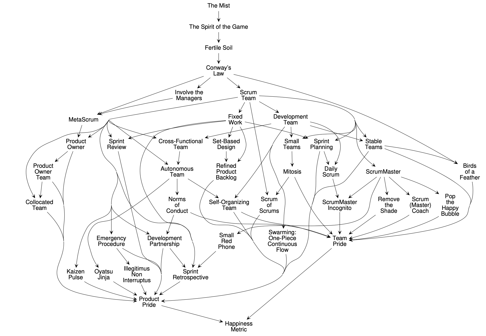
---

---
## Highly recommended
---
### Sauna Sprint Review
- After a particularly successful sprint, or a sprint that is otherwise worthy of celebration, rent a sauna for the sprint review. 
- Start the meeting with a very information review of the sprint activities, focusing on both good and bad as usual. 
- As the meeting goes on, segue into the social side of the event and allow it to continue into the night. 
- Be sure to include local food and some champagne.
---
## Sources 

[Beedle et al] Mike Beedle, Martine Devos, Yonat Sharon, Ken Schwaber, and Jeff Sutherland. “Scrum: An extension pattern language for hyperproductive software development”, PLoP’1998.
- https://www.researchgate.net/publication/2464945_SCRUM_An_extension_pattern_language_for_hyperproductive_software_development
- a scrum book
- ..

--- 
## Thanks for discussing!
- https://github.com/nikkijuk/scrum-pattern-language-discussion
