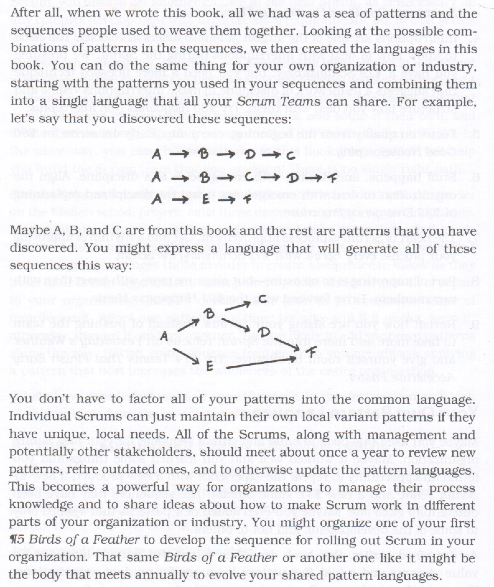

# scrum-pattern-language-discussion

Slides for a discussion about how scrum patterns could be used as part of company or project specific pattern languages 

See here [rendered version of the slides](https://gitpitch.com/nikkijuk/scrum-pattern-language-discussion/master?grs=github&t=moon)

# Motivation from Wikipedias [Organisational patterns](https://en.wikipedia.org/wiki/Organizational_patterns) article

"
Patterns provide an incremental path to organizational improvement. 

The pattern style of building something (in this case, an organization) is:

    Find the weakest part of your organization
    Find a pattern that is likely to strengthen it
    Apply the pattern
    Measure the improvement or degradation
    If the pattern improved things, 
       go to step 1 and find the next improvement; 
       otherwise, undo the pattern and try an alternative.
"

# Motivation from "A Scrum Book" website

"
The pattern languages described in this book are generic. They describe patterns as general forms from which individual teams can choose to build a foundation for their own work. Yet every product is different and every team is different. While your team should take to heart many of the patterns in this book, your insight (and experience) will lead you to leave some out. And, what's more, you will find some of your own.

Alexander recommends that you should get started with a pattern language by selecting the patterns that speak to you. You can do that with each of the two pattern languages in this book (the Product Organization Pattern Language and the Value Stream Pattern Language). You are using the patterns to build a one-off Scrum instance as an open-ended project in its own right. Hiroshi Nakano, a colleague of Christopher Alexander, uses the term project language for the set of patterns with which you are working at any given moment.

After you have started, you may discover other patterns that you want to try. Some of them may be Scrum patterns that are beyond the scope of this initial work, while others may relate to specific practices such as pair development or budget-less development. And you may discover variation in how you apply different patterns to different teams within your development effort or your organization. You may want to tailor some of the patterns to your own environment. Alexander recommends that a community take ownership of the patterns in its pattern language, and that the community meet annually to formally delete and add patterns. As this set of patterns matures it becomes a self-standing pattern language in its own right. Alexander subtly uses the phrase “a pattern languageˮ to describe the generic patterns that one can find in a book, and “the pattern languageˮ to describe the version which you have tailored to your organization.
"

# Or from "A Scrum Book" directly

## License

This work is licensed under a [Creative Commons Attribution-NonCommercial-NoDerivatives 4.0 International License](http://creativecommons.org/licenses/by-nc-nd/4.0/)
